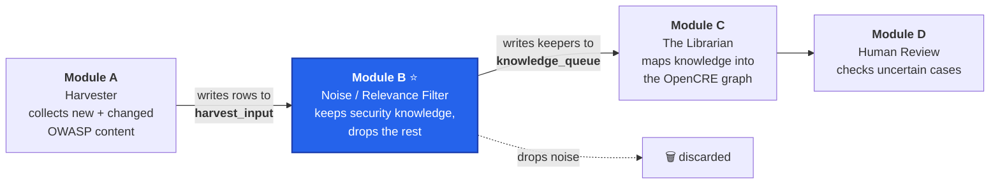
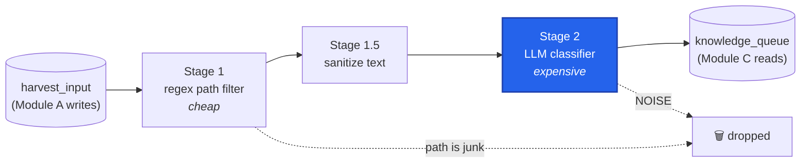

# Wiring a Filter into a Living Pipeline: My GSoC 2026 Final Chapter with OWASP OpenCRE (Module B)

*A final-evaluation story about the second half of building the Noise/Relevance Filter — where the hard part stopped being the code and started being everything around it.*

## Where we left off

In the first half of my **Google Summer of Code 2026** with **OWASP OpenCRE**, I built the brain of Module B: a **recall-first** filter that reads a chunk of harvested content and decides whether it holds security knowledge worth keeping. It reached **93% agreement** with a human-labeled benchmark while **never once dropping a real piece of security knowledge**, and it passed mid-evaluation. 🎉

> 📖 *If you're just arriving, the mid-evaluation blog tells that first-half story — the recall-first pivot, building a stand-in for Module A, and teaching a small model to filter security content.*
> **→ [Read the mid-evaluation blog on Medium](https://medium.com/@manshusainishab/teaching-a-filter-to-never-lose-security-knowledge-my-gsoc-2026-journey-with-owasp-opencre-module-5ad2a4f2f92d?sharedUserId=manshusainishab)**

This post is about the second half — and honestly, it surprised me. I expected to spend it writing more classifier code. Instead I spent it learning what it actually takes to plug one module into three *other* modules that were all still being built at the same time. The code was rarely the hard part. Keeping everything honest, connected, and safe was.

## A quick reminder of the map

OpenCRE's new Scraper & Indexer (Project OIE) is a nightly pipeline of four modules, each built by a different contributor:

My module is the **cost gate** in the middle. Module C's stage is expensive — embeddings and a cross-encoder — so Module B exists to make sure that expensive work only runs on things worth mapping. And that single idea drives everything, including the rule I refused to break all summer:

> **Recall-first.** Letting a little noise through just wastes some of Module C's time. Dropping a real piece of security knowledge loses it *forever*. So when in doubt, keep it.

## From a brain to a pipeline stage

At mid-eval, my module could look at a chunk and give a verdict. But a real pipeline stage needs to *read its input from somewhere* and *write its output somewhere the next module can pick up.* The team agreed on a clean design: a nightly **orchestrator** runs A → B → C in order, handing off through a shared **Postgres** database.

So Module B grew two ends ([#989](https://github.com/OWASP/OpenCRE/pull/989)):

- **`harvest_input`** — Module A drops each harvested chunk here; my filter reads the pending rows for a run.
- **`knowledge_queue`** — my filter writes the keepers here; Module C reads them.

The nicest part was how *little* the core had to change. The three-stage gate from the first half stayed exactly the same — only the plumbing at the two ends was new:

### The bug that only existed on Postgres

While getting a fresh database to build from scratch, a migration failed — but only on **Postgres**, never on the SQLite I'd been developing on. An earlier migration had renamed two *different* unique constraints to the *same* name. On Postgres, a unique constraint is a database-wide index, so the second one collided; on SQLite, constraint names are scoped to their table, so it quietly worked. I tracked it down and fixed it in its own PR ([#988](https://github.com/OWASP/OpenCRE/pull/988)) before my feature PR.

That one cost me an afternoon, but it taught me a lesson I keep coming back to: **"works on my machine" and "works in production" are often running two different databases.**

## Making the contracts real

Three modules, three people, all building at once. The only way that doesn't collapse into chaos is **contracts** — a written spec of exactly what Module A emits and exactly what Module C reads, so nobody has to reverse-engineer anyone else's code to integrate.

I'd been keeping these as documents shared over Slack. In the second half I committed them properly into the repo ([#1019](https://github.com/OWASP/OpenCRE/pull/1019)) so they'd live next to the code and get reviewed like code. That review became one of the most humbling — and useful — parts of the whole project.

The automated reviewer kept catching me describing **code that wasn't merged yet.** My B→C contract confidently claimed "Module C mirrors this table exactly" — which was true in Module C's *open* pull request, and completely false on the actual `main` branch, where Module C still read an older, simpler shape. I'd written a contract against the future and called it the present.

In a single week I watched one sentence — "Module C reads both labels" — flip through three different states: first it was a *plan*, then the bot correctly told me it *wasn't shipped yet*, then a few days later Spyros merged Module C's change and it genuinely *was* shipped. The lesson finally sank in:

> A contract that spans three modules being built in parallel is only ever as current as your last `git fetch`. **Point at the actual symbol in the actual file — not at what everyone agreed to do in a meeting.**

## A label is a hint, not a gate

Module B tags each keeper `KNOWLEDGE` or `UNCERTAIN`. A real question came up between my module and Module C: who decides which chunks a human (Module D) eventually reviews?

Module C's first design read only the `KNOWLEDGE` rows and planned to send everything `UNCERTAIN` straight to Module D. I flagged that this had it backwards. My module is recall-first: it already drops the `NOISE`, and an `UNCERTAIN` chunk isn't one I judged worthless — it's one I was unsure about *classifying*. So the cleaner rule is that **my label is a confidence *signal*, not a routing *instruction*.** Module C should consume *both* labels and decide for itself what actually needs a human, using its own logic — my label is an input to that decision, never a gate on it.

This mattered a lot, because Module D doesn't exist yet. Under the `KNOWLEDGE`-only design, every `UNCERTAIN` chunk would have piled up in the queue forever, stranded twice over — nothing would retrieve CRE candidates for it, and with no Module D around to mark it consumed, it would just accumulate behind a status nobody would ever update. A quiet recall-first leak, hiding in the gap between two modules that were each, individually, completely correct.

**Prateek Singh**, who builds Module C, agreed and fixed it on his side ([`a135742`](https://github.com/OWASP/OpenCRE/commit/a135742)): `DbKnowledgeSource` now reads `llm_label IN ('KNOWLEDGE', 'UNCERTAIN')`, and every decision records which label it came from — so my *uncertainty* and his *confidence* stay two separate, answerable questions.

While reconciling that same contract, I noticed Module C read the queue **without locking the rows it was working on** — which is unsafe the moment you run more than one consumer at once. It wasn't a live bug (today the orchestrator runs a single consumer per run), but I wrote it up as an issue ([#1025](https://github.com/OWASP/OpenCRE/issues/1025)), and **Prateek** shipped a tidy opt-in fix for it ([#1030](https://github.com/OWASP/OpenCRE/pull/1030)) too. Reviewing someone else's module and having mine reviewed back — cross-module code review going both directions — is the part of open-source collaboration that no tutorial had prepared me for, and the part I ended up enjoying most.

## The bug that wasn't data loss

The last real piece of engineering started as a single review question: *what happens when the AI call itself fails?*

My original filter did the safe-sounding thing: if the model was unreachable, it marked those chunks `UNCERTAIN` with confidence `0.0` and moved on. But because the queue de-duplicates on a content fingerprint, that `0.0` row got **stuck forever** — a later run could never come back and give it a real answer. A brief network blip permanently downgraded a chunk that might have been genuine security knowledge; a *total* outage produced a whole run of `UNCERTAIN 0.0` that still reported success, so the orchestrator had no idea anything had gone wrong.

Here's the subtle bit: this was never *data loss* — recall-first still held, the chunk still reached Module C. The real problem was quieter. **My filter couldn't tell "the model is unsure" apart from "the model was unreachable," and treated both as final.**

Talking it through with **Spyros** and **Parth** — the maintainers — we landed on combining two fixes ([#1034](https://github.com/OWASP/OpenCRE/pull/1034)):

1. **Retry the small blips.** An infrastructure failure no longer writes a fake verdict — the chunk's input row is simply left **`pending`**, so the next run naturally retries it.
2. **Shout about the big ones.** If a whole run fails, it reports `degraded` and exits with an error, so the orchestrator retries the run instead of quietly moving on.

There was one trap hiding in my first attempt, which the reviewer caught: I'd used the *model's own explanation text* to decide whether something was retryable. But the model controls that text — it could theoretically echo the exact phrase and trick my filter into retrying a perfectly good answer. The fix was to base the decision on a **trusted flag** that only my own error-handling code can set, and that the model's response can never touch.

I then verified the whole thing on a real Postgres database: a normal run drains cleanly; a forced outage leaves the rows `pending` and exits with an error; and re-running picks up *exactly* those rows and finishes the job. Watching it recover on its own was genuinely satisfying.

> The bug was never that my filter lost data — it didn't. It was that it couldn't tell an **opinion** from an **outage**. The fix was one honest distinction: an infrastructure failure isn't a verdict, so don't record one — just leave the work for next time.

## The final numbers

I re-ran the full evaluation — the complete gate, real model, same 100 hand-labeled OWASP chunks — to confirm the number still held after all the pipeline work:

| Metric | Result |
|---|---|
| Overall agreement (accuracy) | **93%** |
| Security knowledge lost | **0 out of 56** — a perfect 100% recall |
| Noise correctly removed | 37 out of 44 (≈84%) |
| When it chose DROP, was it right? | **100%** |

And the confusion matrix — predictions against the true labels:

| Gold ↓ \ Predicted → | KEEP | DROP | UNCERTAIN |
|---|:---:|:---:|:---:|
| **KEEP** | **56** ✅ | 0 | 0 |
| **DROP** | 7 | **37** ✅ | 0 |
| **UNCERTAIN** | 0 | 0 | 0 |

That top row is the whole point: **56 KEEP examples, and not one slipped into DROP.** Every mistake lives in the safe DROP row — a little extra work for Module C, never a lost insight. Recall stayed at **100% across every single iteration** of the entire project. It's all one command over committed inputs, written up in [`final_metrics.md`](../gsoc_2026_module_b/final_metrics.md) ([#1035](https://github.com/OWASP/OpenCRE/pull/1035)) so anyone can reproduce it.

## Everything that shipped

The whole of Module B is now in OpenCRE's `main`:

| Piece | PR |
|---|---|
| Input contract, schemas, benchmark dataset | [#913](https://github.com/OWASP/OpenCRE/pull/913) |
| Stage 1 regex filter + Stage 1.5 sanitize | [#928](https://github.com/OWASP/OpenCRE/pull/928) |
| Stage 2 LLM relevance classifier | [#947](https://github.com/OWASP/OpenCRE/pull/947) |
| Evaluation harness + recall-first gold corrections | [#976](https://github.com/OWASP/OpenCRE/pull/976) |
| Postgres migration fix | [#988](https://github.com/OWASP/OpenCRE/pull/988) |
| DB integration (`harvest_input` + `knowledge_queue`) | [#989](https://github.com/OWASP/OpenCRE/pull/989) |
| Mid-evaluation blog | [#1004](https://github.com/OWASP/OpenCRE/pull/1004) |
| Committed contracts + operator runbook | [#1019](https://github.com/OWASP/OpenCRE/pull/1019) |
| Infrastructure-failure retry policy | [#1034](https://github.com/OWASP/OpenCRE/pull/1034) |
| Final evaluation metrics | [#1035](https://github.com/OWASP/OpenCRE/pull/1035) |

**Still ahead:** a full A → B → C run on a shared database now that all three modules are real; retiring the stand-in harvester I built to unblock myself; and RSS support once Module A starts emitting feeds.

## What I'm taking away

The first half of GSoC taught me how to build a thing. The second half taught me how to make a thing *belong* somewhere.

- **Integration is the real project.** Writing a module that plugs into three others being built in parallel is a different skill from writing the module — and it's mostly about communication, contracts, and trust.
- **A document can drift from the truth just like code.** My contract kept describing a future that hadn't merged. Point at the actual symbol, not the agreement.
- **Tell a bug that loses data from a bug that just looks scary.** The retry issue felt alarming, but recall-first had it covered; the real fix was a small, honest distinction, not a panic.
- **Recall-first was the compass the whole way.** Every hard call got easier the moment I asked: *which choice risks losing security knowledge?* — and did the other one.

## Thanks

Huge thanks to the OpenCRE maintainers — **Spyros**, **Parth**, and **Paola Gardenas** — for the reviews, the guidance, and the welcoming space to do this work. Spyros and Parth in particular walked me through the calls that shaped the module, from the recall-first pivot in the first half to the retry policy in the last, and made it far better than I'd have made it alone. Thanks also to the contributors on the sister modules, **Parth Aggarwal** (Module A) and **Prateek Singh** (Module C): building alongside you, reviewing each other's work, and negotiating the contracts between our modules was the most valuable part of the summer. And thanks to the wider OWASP OpenCRE community for making a first big open-source contribution feel welcome.

*Thanks for reading — that's Module B, from an idea to a filter that quietly makes sure no piece of security knowledge ever slips through the cracks.*
