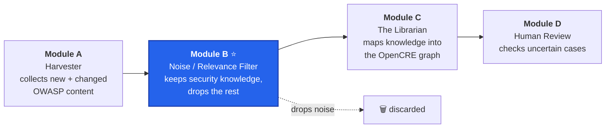

# Teaching a Filter to Never Lose Security Knowledge: My GSoC 2026 Journey with OWASP OpenCRE (Module B)

*A mid-evaluation story of building the Noise/Relevance Filter for OpenCRE's new Scraper & Indexer pipeline.*

## Where it all started

This summer I got the opportunity to work with **OWASP OpenCRE** as part of **Google Summer of Code 2026**, and it's honestly been one of the coolest learning experiences I've had so far.

If you haven't heard of OpenCRE before, it's OWASP's **Common Requirement Enumeration** — think of it as a huge map that connects security standards, cheat sheets, testing guides, and tools together. Instead of jumping between different security resources, OpenCRE tries to bring all those connections into one place.

The problem the maintainers wanted to solve this year sounds simple, but it's actually pretty tricky. Security knowledge across OWASP projects keeps changing all the time someone adds a better SSRF example, someone fixes a testing guide for subdomain takeovers, someone updates a CSRF recommendation. All of that is valuable, but until now there wasn't an automated way to detect those changes and bring them into OpenCRE.

To solve that, the team is building a pipeline with four different modules:

* **Module A – Harvesting:** Collects new and updated content from OWASP repositories every night.
* **Module B – Noise/Relevance Filter:** That's my module. It decides whether the collected content actually contains security knowledge worth keeping.
* **Module C – The Librarian:** Maps that knowledge to the correct place inside the OpenCRE graph.
* **Module D – Human Review:** Gives reviewers a chance to look at uncertain cases before they're added.

Here's how the four modules fit together:

My module sits right in the middle of all this. You can think of it as the **gatekeeper**: every single piece of content has to pass through it before moving further down the pipeline.

## Why this gate mattered so much

Very early in the project, I realized something that completely changed how I approached the filter: **the two mistakes my module can make are not equally bad.**

If I accidentally let some junk through - a sponsorship page, meeting notes, some project documentation — the worst case is that Module C spends a little extra time processing it before ignoring it. Not ideal, but not a huge problem. The scary mistake is the opposite: if my filter throws away an actual piece of security knowledge, it's gone. It never reaches the OpenCRE graph, and the downstream modules never even know it existed.

That made the goal surprisingly clear. I wasn't trying to build the "most accurate" classifier anymore — I wanted a filter that **never loses real security knowledge**, even if that means being a little generous and keeping some borderline content. In ML terms, that's optimizing for **recall over precision**, but I usually explain it in a much simpler way:

> **When I'm unsure, I'd rather keep the content than accidentally throw away something valuable.**

That one idea ended up influencing almost every technical decision I made during the project.

## The decision that changed everything: recall first

Interestingly, I didn't start with this mindset. During my pre-project experiments I was using a much stricter rule:

> **"Does this commit introduce NEW security knowledge?"**

It sounded reasonable at first, but that definition had a problem I didn't notice until I discussed my results with my mentor. Imagine someone fixes a typo inside a CSRF mitigation guide, or adds another example explaining an existing XSS attack, or rewrites a paragraph to make it much easier to understand. None of that is technically **new** knowledge, so under my original rule all of it would have been labeled as noise.

That's when it clicked. Even though the information wasn't new, it was still valuable security knowledge — and if my filter dropped those changes, OpenCRE would slowly miss corrections, clarifications, and better explanations over time. That wasn't something we wanted.

After discussing it with my mentor Spyros, we changed the entire philosophy of the module. Instead of asking *"Is this new?"* we started asking **"Does this contain security knowledge?"** — and that tiny change completely changed how the filter behaved. From that point onward, the rules became pretty simple:

* **KEEP (KNOWLEDGE):** Anything that contains a security signal — attacks, vulnerabilities, mitigations, testing techniques, code samples, clarifications, typo fixes, additional examples, or even updated references inside security content.
* **DROP (NOISE):** Content that has nothing to do with security, like sponsorship pages, meeting notes, project governance, website layout, or build configurations.
* **UNCERTAIN:** Only for those rare cases where it genuinely wasn't obvious.

Looking back, this was probably the most important decision we made during the first half of the project — and what's interesting is that it wasn't some clever algorithm or optimization. It came from a conversation. Sometimes the biggest improvements don't happen because of code; they happen because someone asks the right question.

---

## Building my own fake Module A

There was one practical challenge in the beginning. Module A — the Harvester — was being developed by another GSoC contributor at the same time, and since we were working in parallel, I couldn't just sit around waiting for their implementation before starting my own. I needed data.

So I built a lightweight version myself: a small script that fetched recent commits from four OWASP repositories — the Web Security Testing Guide (WSTG), ASVS, the Cheat Sheet Series, and SAMM — plus a simple tool that let me manually classify each chunk as **KEEP**, **DROP**, or **UNCERTAIN**. It was never meant to replace Module A; it was just enough to unblock myself and start building Module B. By the end of it, I had a hand-labeled dataset of 100 examples that became the foundation for everything else.

A little later, the contributor working on Module A shared their actual output format, and it looked pretty different from what I'd imagined. The fields were organized differently, and a few things I'd expected — like commit messages and content fingerprints — weren't included at all. Instead of trying to convince everyone to change their format, I decided to adapt my module: I started generating the content fingerprint myself, and instead of relying on commit messages for context, I used the document breadcrumb (something like **Authentication → JWT**) to help the model understand where each chunk came from. We also documented the interface properly so both modules knew exactly what to expect from each other.

That experience taught me something I hadn't appreciated before: **writing a clean interface between two systems is just as important as writing the code inside those systems.**

---

## Building the gate, one layer at a time

With the data ready, it was finally time to build the actual filter. One thing I wanted from the beginning was efficiency — there's no point asking an LLM to process every single file if some of them can be rejected in milliseconds — so I designed the pipeline in three stages, starting from the cheapest checks and gradually moving toward the expensive ones.

### 1. Quick path filtering

Some files don't even deserve an AI call — images, stylesheets, lock files, build folders, CI configurations. These can usually be identified just by looking at the file path, so I created a simple, editable list of patterns that filters them out immediately.

The important part, though, was staying faithful to the recall-first philosophy. I only blocked something when I was almost certain it could never contain security knowledge; if there was even a small chance a file could include useful content, I let it pass to the next stage. Being a little extra cautious here was much safer than accidentally dropping something important.

### 2. Cleaning messy text

Raw content collected from repositories isn't always clean — invisible Unicode characters, weird spacing from PDFs, leftover HTML markup, words split in strange places by line wrapping. All of those small issues make life harder for an LLM.

Instead of writing another cleanup library from scratch, I found a lightweight public-domain utility from another open-source project and adapted it for my use case. (Even though the license didn't require attribution, I still credited the original author, because it felt like the right thing to do.) One important change was preserving paragraph structure instead of flattening everything into one giant block of text — surprisingly, keeping those paragraphs intact helped the model understand context much better.

### 3. Letting the AI decide

Finally came the interesting part. Each cleaned chunk is sent to a lightweight language model along with its heading breadcrumb, and the model predicts one of three labels — KEEP, DROP, or UNCERTAIN — along with a confidence score and a short explanation of why it made that decision.

I intentionally kept this model separate from the larger chatbot models. Since this filter may eventually process thousands of commits, every API call matters, and a smaller, cheaper model keeps the pipeline fast while still producing reliable results.

The most important part, though, wasn't the model itself — it was the prompt. At the very top I reinforced the recall-first philosophy, then included several carefully chosen examples, especially the tricky ones that humans often disagree on (things like *"a typo fix inside a mitigation guide is still KEEP"*). Those examples ended up teaching the model far better than instructions alone ever could.

## Time to see if it actually worked

Building a filter is one thing; knowing whether it's doing the right job is a completely different challenge. I didn't want to rely on intuition or manually check a few examples every time I changed the prompt — that would have made it almost impossible to compare different versions fairly — so I built an **evaluation harness**.

The idea was simple: run the entire filtering pipeline on my hand-labeled dataset and compare the predictions against the expected labels. For every run, it reported the overall agreement with the human labels, which examples were classified incorrectly, and — most importantly — whether the filter had accidentally dropped any real security knowledge. That last metric became my favorite. I honestly didn't care if the model kept a few extra chunks of noise, but if it dropped even one genuine piece of security knowledge, I wanted to know immediately.

The first complete evaluation finished with **82% agreement**. I was pretty happy with that, but when I looked closer, two things stood out.

The first one almost gave me a heart attack. I tested the model on a small batch of examples and almost every prediction came back as **KEEP** — for a few minutes I genuinely thought I'd built a classifier that wasn't filtering anything at all. Thankfully that wasn't what was happening: the sample I'd picked just happened to contain chunks from the same security document. Once I evaluated all 100 examples the picture looked very different, with the model rejecting plenty of obvious noise while still preserving every piece of security knowledge. That was my first reminder that small samples can be incredibly misleading — if I'd stopped there, I might have started "fixing" a problem that didn't even exist.

The second discovery was even more interesting. Instead of assuming every disagreement meant the model was wrong, I decided to inspect them one by one, and I noticed a pattern: several examples describing real security concepts — like a GitHub subdomain-takeover walkthrough or a list of dangerous DOM methods related to XSS — had been labeled **UNCERTAIN** in my dataset. That didn't make sense anymore. By this point recall-first had already become the foundation of the project, and under that definition those examples were clearly **KEEP**. The model wasn't making the wrong prediction; my dataset was still following an older way of thinking. So rather than tweaking the prompt again, I went back and updated the labels to match the rule I'd already committed to.

That was a surprisingly valuable lesson. I'd spent a lot of time trying to improve the *model*, only to realize that some of the biggest improvements came from improving the *dataset* itself. A benchmark is only as good as the labels behind it — and sometimes the model is the one pointing out the inconsistencies in your own data.

---

## The trap I almost walked into

After fixing those labels, I started improving the prompt itself, and one weakness became obvious pretty quickly: the model was sometimes keeping organizational content — release notes, translation updates, license pages — simply because they mentioned projects such as ASVS or the Cheat Sheet Series. Technically those pages were related to OWASP, but they weren't security knowledge. So I refined the prompt with one simple clarification:

> Mentioning a security project is **not** the same as containing security knowledge.

That tiny change made a surprisingly big difference — the agreement climbed to **91%**. For a moment I thought I had solved it. Then I looked at the one metric I cared about most: the "lost knowledge" count had increased from **zero to three.**

That immediately worried me, because throughout the project I'd promised myself one thing — never sacrifice recall just to improve an accuracy number. My first instinct was to throw away the prompt changes and go back to the older version. But before doing that, I wanted to understand exactly what those three examples were.

When I inspected them manually, the answer was surprisingly simple: they weren't really security knowledge at all. They were standalone headings — things like **`# DOM Based XSS Prevention Cheat Sheet`** — with no explanation, no body, no examples, just the title. The actual security content still existed in the chunks that followed; these isolated heading fragments weren't adding anything useful. The problem wasn't the prompt — it was the dataset. Those title-only chunks had been labeled inconsistently, some marked **KEEP** and others **DROP**, with no consistent reasoning behind them.

After another discussion with **Spyros**, we agreed on a cleaner rule: if a chunk only contains a heading and no meaningful content underneath it, it's simply noise. Once I updated those labels, everything lined up again — the recall-first philosophy stayed intact, the prompt improvement remained, and the evaluation became much more consistent.

That entire experience changed how I think about machine learning projects. When a metric suddenly gets worse, the first reaction shouldn't be to undo your latest change. Sometimes the better question is: **"Is the data actually telling the truth?"** — and that question saved one of the biggest improvements I made during the first half.

---

## Where things stood at the mid evaluation

After several rounds of testing, prompt improvements, and label corrections, I finally reached a point where I felt confident in the system. Here's where things stood:

* **93% agreement** with the human-labeled dataset.
* **Zero pieces of security knowledge lost** throughout the evaluation.
* A noticeable increase in the amount of noise removed before it could reach the downstream modules.
* Every remaining mistake leaned toward the safer side — keeping slightly more content instead of risking the loss of genuine security knowledge.

To put some real numbers behind that, here's the final scorecard on the 100-example benchmark:

| Metric | Result |
|---|---|
| Overall agreement (accuracy) | **93%** |
| Security knowledge lost | **0 out of 56** — a perfect 100% recall on KEEP |
| Noise correctly removed | **37 out of 44** (≈84%) |
| When it chose DROP, was it right? | **100%** — it never once dropped real knowledge |

And here's the **confusion matrix** — the grid of what the model predicted against what the label actually said:

| Gold ↓ \ Predicted → | KEEP | DROP | UNCERTAIN |
|---|:---:|:---:|:---:|
| **KEEP** | **56** ✅ | 0 | 0 |
| **DROP** | 7 | **37** ✅ | 0 |
| **UNCERTAIN** | 0 | 0 | 0 |

The most important cell is that top row: **56 KEEP examples, and not a single one slipped into DROP.** That's the "zero knowledge lost" promise made concrete. The only mistakes live in the DROP row — 7 pieces of noise the model held onto — and those are the *safe* kind of mistake: a little extra work for Module C to shrug off, never a lost piece of security knowledge.

It's also worth showing *how* the score got there, because it wasn't one big jump:

| Stage | Agreement | Knowledge lost |
|---|:---:|:---:|
| First full run | 82% | 0 |
| After fixing stale labels | 87% | 0 |
| After the project-mention prompt fix | 91% | **3** |
| After the heading-only rule | **93%** | **0** |

Recall ended at a perfect **100%**, and every mistake along the way was the safe kind. The one moment it dipped — those 3 "lost" chunks at 91% — turned out to be empty heading fragments, not real knowledge, and fixing the labels recovered it immediately.

For me, that last point mattered far more than any accuracy percentage. The filter was behaving exactly the way I'd hoped: when it wasn't sure, it chose caution. I walked **Maintainers** through the results and the reasoning behind each major decision, and I'm happy to say that I successfully passed my **Google Summer of Code 2026 Mid Evaluation.** 🎉 That was one of the most satisfying moments of the summer — not just because I passed, but because I could clearly see how much the project had evolved from where it started.

## What I'm taking away from the first half

A few lessons that feel bigger than this one project:

- **Decide what you refuse to get wrong, and defend it relentlessly.** For me it was "never lose security knowledge." Having one non-negotiable made every trade-off obvious.
- **Check your ground truth before you blame your model.** A third of my "errors" were my own outdated labels. If I'd only tuned the prompt, I'd have been optimizing toward wrong answers.
- **When a metric moves the wrong way, understand *why* before you react.** My instinct said "revert the prompt." The right answer was "fix the data." Looking closely saved a real improvement.
- **Interfaces between people are as important as code.** The clearest thinking I did all summer went into a shared contract document, not a source file.

## What's next

The second half is about **wiring things together for real.** The team has decided on an orchestrator that will run everything on a nightly schedule: it triggers the harvester, which writes its output to a database; then it triggers my filter, which reads that data, classifies it, and writes the keepers into a "knowledge queue" for the Librarian to pick up. So my next job is to make Module B a well-behaved citizen of that pipeline — reading from the shared database, doing its work, and reporting back when it's done.

And once the pipeline is genuinely running end to end, I'll clean up the scaffolding — the stand-in harvester and hand-labeled dataset that got me here — because at that point the real Module A will be feeding real data, and the gate I built will finally be doing the job it was made for: quietly making sure no piece of security knowledge ever slips through the cracks.

*Thanks for reading. More at the final evaluation.*
